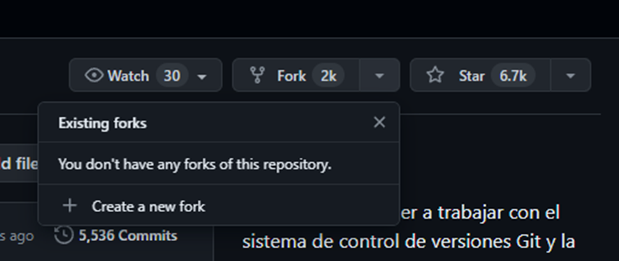
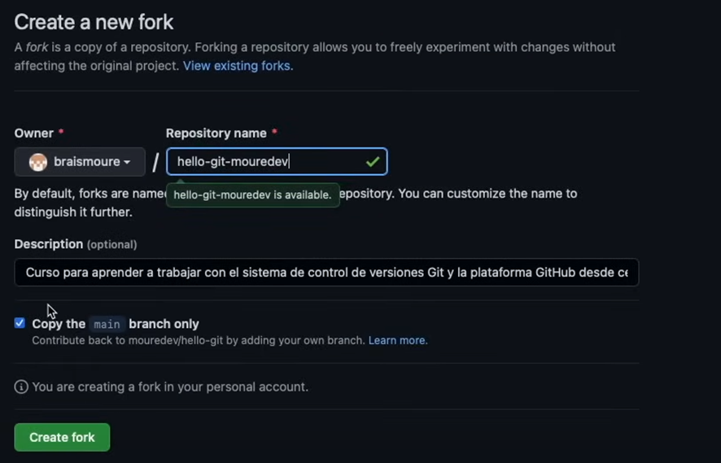
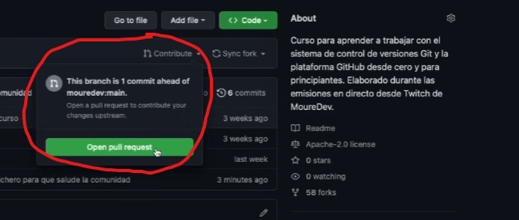
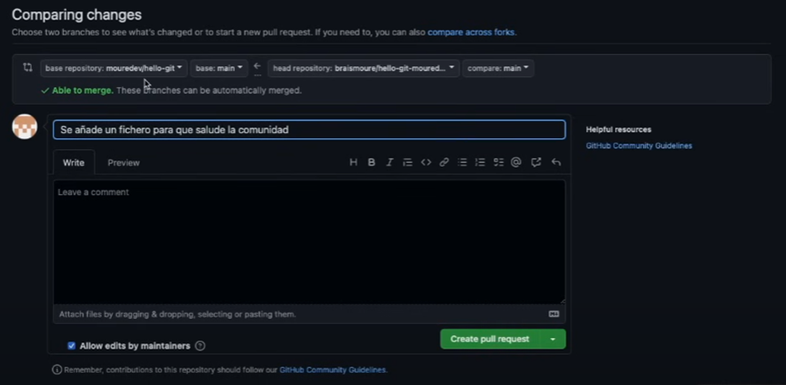
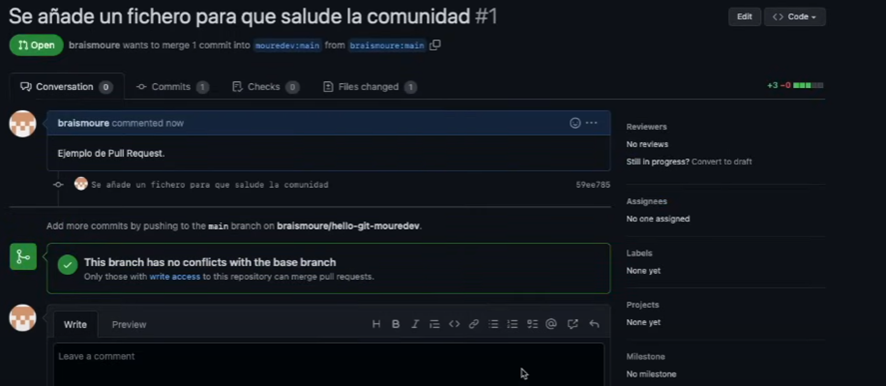
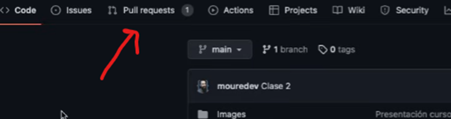
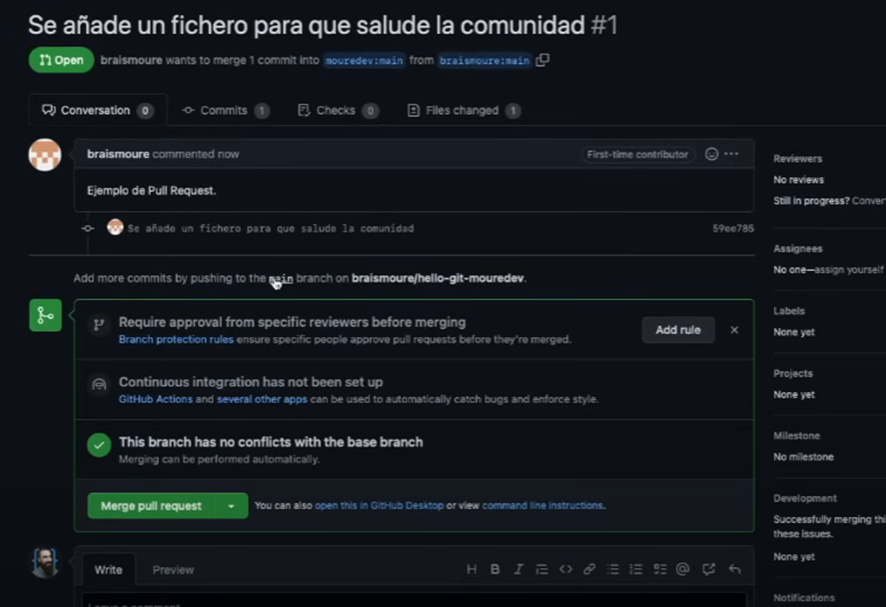
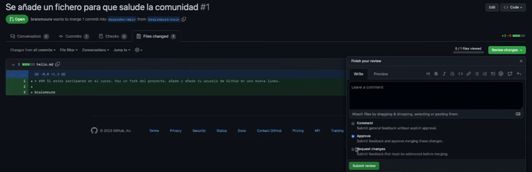
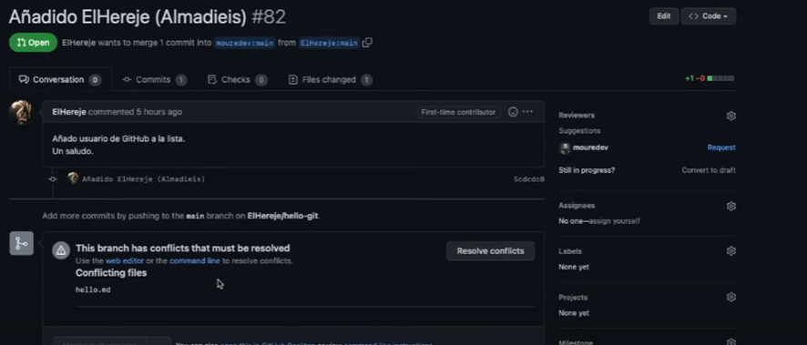

# Tutorial Git y GitHub

> Guía práctica de **Git y GitHub** con los comandos esenciales para gestionar versiones y colaborar en proyectos.  
> Para un flujo de trabajo más profesional, consulta [**git_workflow_guide.md**](./git_workflow_guide.md),  
> y para comandos avanzados como `pull --rebase` o `cherry-pick`, revisa [**git_comandos_avanzados.md**](./git_comandos_avanzados.md).


## Índice de contenidos

- [Comandos de Git](#comandos-de-git)
  - [Intro](#intro-top-)
  - [Git innit](#git-innit-top-)
  - [Giy add](#giy-add-top-)
  - [Git commit](#git-commit-top-)
  - [Git log](#git-log-top-)
  - [Poner un alias](#poner-un-alias-top-)
  - [Git status](#git-status-top-)
  - [Git checkout](#git-checkout-top-)
  - [Git reset](#git-reset-top-)
  - [Git diff](#git-diff-top-)
  - [Git tag](#git-tag-top-)
  - [Git branch](#git-branch-top-)
  - [Git switch](#git-switch-top-)
  - [Git merge](#git-merge-top-)
  - [Git stash](#git-stash-top-)
- [Comandos de GitHub](#comandos-de-github)
  - [Intro – autentificación SSH en GitHub](#intro--autentificación-ssh-en-github)
  - [Git remote](#git-remote-top-)
  - [Git push](#git-push-top-)
  - [Git fetch](#git-fetch-top-)
  - [Git pull](#git-pull-top-)
  - [Git clone](#git-clone-top-)
  - [Fork y pull request](#fork-y-pull-request-top-)
- [Extra: GitFlow](#extra-gitflow)
  - [Ejemplo de uso de GitFlow](#ejemplo-de-uso-de-gitflow-top-)


## Comandos de Git
### Intro [top ↑](#)
Comandos para establecer la configuración inicial, establecer un usuario y su email: 
```bash
git config --global user.name “nombreUsuario”
git config –global user.email “nombreUsuario@email.com”
```

### Git init [top ↑](#)
```bash
git init
```
El comando `git init` crea un nuevo repositorio de Git y puede utilizarse para convertir un proyecto existente y sin versión en un repositorio de Git o inicializar un nuevo repositorio vacío.

Si queremos hacer que en un directorio de trbabajo git ignore alguno archivos (que no queremos actualizar) podemos crear un archivo `.gitignore` y añadir en él el nombre de los archivos/directorios que queramos que git ignore. 

Ejemplo de archivo `.gitignore` para un repo de un backend hecho con pyhton: 
```
# Bytecode y caché
__pycache__/
*.py[cod]
*.pyo

# Entornos virtuales
.venv/
env/
venv/

# Configuración de entorno local
.env

# Archivos temporales / de sistema
.DS_Store
Thumbs.db

# Archivos de testing/coverage (opcional)
coverage/
htmlcov/
.tox/
pytest_cache/
.cache/

# Compilaciones (si usas Cython o similares)
build/
dist/
*.egg-info/

# Logs
logs
*.log
npm-debug.log*
yarn-debug.log*
yarn-error.log*
pnpm-debug.log*
lerna-debug.log*

node_modules
dist
dist-ssr
*.local

# Editor directories and files
.vscode/*
!.vscode/extensions.json
.idea
.DS_Store
*.suo
*.ntvs*
*.njsproj
*.sln
*.sw?
*.swp
*.sublime*
```

### Git add [top ↑](#)
```bash
git add
```

El comando git add añade un cambio del directorio de trabajo en el entorno de ensayo: 
```bash
git add nombre_fichero
```

Si hacemos: 
```bash
git add .
```

Se añadirán todos los cambios pendientes. 

### Git commit [top ↑](#)
```bash
git commit -m
```

El comando git commit guardará todos los cambios hechos en la zona de montaje o área de preparación (`staging area`), junto con una breve descripción del usuario, en un "commit" al repositorio local. Puedes pensar en un commit como una captura de tu proyecto, donde se crea una nueva versión de ese proyecto en el repositorio actual. 

Con `-m` podemos especificar a continuación un mensaje de información sobre el commit, entre comillas. Es obligatorio. Si no se pone nos saldrá un molesto mensaje. 

### Git log [top ↑](#)
```bash
git log
```

El comando git log permite visualizar el historial de los commit, filtrarlo y buscar cambios específicos. Tiene muchas opciones para poder filtrar los resultados o estilizar su visualización. Por ejemplo:
```bash
git log --graph --decorate --all –oneline
```

Nos mostrará el historial de commits compactado, solo con la parte final del hash de cada commit. 

### Poner un alias [top ↑](#)
Con `git config --global alias.nombre_alias "comando"`, podemos poner un alias a un comando que queramos reutilizar sin necesidad de memorizar todo el comendo. Por ejemplo, podemos poner un alias al comando anterior: 
```bash
git config --global alias.tree "log --graph --decorate --all --oneline"
```

### Git status [top ↑](#)
```bash
git status
```

El comando git status muestra el estado actual de la `working directory` y de la staging area, permitiendo ver que archivos modificados se han añadido a la staging area, que archivos modificados no han sido añadidos a la staging area y que archivos no se rastrean en el repository.

### Git checkout [top ↑](#)
```bash
git checkout
```

El comando git checkout es una herramienta versátil que se utiliza principalmente para cambiar entre ramas, deshacer cambios en el área de trabajo y moverse a diferentes puntos en el historial del repositorio.

Supongamos que has hecho cambios en un archivo y deseas deshacerlos para volver a la versión anterior. Puedes utilizar `git checkout` seguido del nombre del archivo: 
```bash
git checkout archivo_modificado.txt 
```

**Deshacer todos los cambios en el área de trabajo:**
```bash
git checkout .
```

**Para realizar un checkout a un commit específico:**
```bash
git checkout id-del-commit-específico
```

**Para realizar checkout a una rama existente, ejecuta el comando:**
```bash
git checkout NOMBRE-DE-LA-RAMA
```

**Checkout a una rama nueva:**
```bash
git checkout -b NOMBRE-DE-LA-RAMA-NUEVA
```

### Git reset [top ↑](#)
```bash
git reset
```

El comando git reset se utiliza en Git para deshacer cambios en el repositorio y modificar la posición del puntero `HEAD`. 

**Deshacer cambios en el área de preparación (staging)**:
Supongamos que has agregado algunos archivos al área de preparación (staging) usando git add, pero ahora deseas deshacer esos cambios y volver a dejar los archivos sin preparar. Puedes utilizar `git reset` con la opción `--mixed` o sin ninguna opción para lograrlo. Por ejemplo: 
```bash
git reset HEAD archivo.txt
```

Este comando eliminará `archivo.txt` del área de preparación, pero los cambios en el archivo permanecerán en tu directorio de trabajo.

**Deshacer cambios en el área de preparación y en el directorio de trabajo**:
Si deseas deshacer los cambios en el área de preparación y también en el directorio de trabajo (es decir, eliminar los cambios que hiciste), puedes usar `git reset` con la opción `--hard`. Por ejemplo: 
```bash
git reset --hard HEAD
```

Este comando deshará todos los cambios en el área de preparación y en el directorio de trabajo, restaurando todo al estado en el que se encuentra el último commit.

**Deshacer commits y mover el puntero HEAD**:
```bash
git reset --soft HEAD~1
```

Este comando moverá el puntero HEAD al commit anterior (`HEAD~1`), manteniendo los cambios de ese commit en el área de preparación y en el directorio de trabajo.

**reflog**:
Si la cagamos con un git reset `--hard`. Aún tenemos opción a recuperar el trabajo empleando el comando: 
```bash
git reflog 
```

Aquí podremos ver el historial de TODOS los cambios con sus referencias (los reseteados también). De este log podemos recuperar la referencia (id) a los cambios resetados con git reset, si volvemos a hacer un reset `--hard` a sus id. 

### Git diff [top ↑](#)
```bash
git diff
```

Con este comando mostraremos los cambios que se han realizado en el directorio de trabajo siempre que se hayan realizado cambios sin haber hecho commit.  

### Git tag [top ↑](#)
```bash
git tag
```

El comando `git tag` se utiliza en Git para agregar, mostrar y manipular etiquetas (tags), que son identificadores asociados con puntos específicos en el historial de un repositorio Git.

**Crear una etiqueta ligera**:
```bash
git tag nombre_etiqueta
```

**Crear una etiqueta anotada**:
Una etiqueta anotada es similar a una etiqueta ligera, pero además puede contener información adicional como el nombre del autor, la fecha y un mensaje asociado. Para crear una etiqueta anotada, puedes utilizar el siguiente comando: 
```bash
git tag -a nombre_etiqueta -m "Mensaje asociado a la etiqueta"
```
**Mostrar etiquetas:**
```bash
git tag 
```
**Mostrar información detallada de una etiqueta**:
```bash
git show nombre_etiqueta 
```
**Eliminar etiquetas**:
```bash
git tag -d nombre_etiqueta 
```
También podremos movernos con checkout a una versión indicando su tag en vez de su id. 

### Git branch [top ↑](#)
```bash
git branch 
```
El comando git branch en Git se utiliza para listar, crear y eliminar ramas en tu repositorio.

**Listar ramas**:
```bash
git branch 
```
Esto mostrará todas las ramas disponibles en tu repositorio y resaltará la rama actual con un asterisco (*).

**Crear una nueva rama**:
```bash
git branch nombre_rama_nueva
```

**Eliminar una rama**:
```bash
git branch -d nombre_rama_nueva
```

Si la rama contiene cambios que aún no se han fusionado en otra parte del proyecto, Git no permitirá eliminarla. En ese caso, puedes forzar la eliminación utilizando: 
```bash
$ git branch -D
```

**Renombra la rama localmente**: 
Utiliza el comando git branch `-m` seguido del nombre actual de la rama y el nuevo nombre que deseas asignarle. Por ejemplo, si deseas renombrar una rama llamada `feature` a `nueva_feature`, puedes hacerlo de la siguiente manera:
```bash
git branch -m feature nueva_feature
```

Desde la rama “master” podemos hacer esto sin tener que cambiar de rama para cambiar su nombre a “main”: 
```bash
git branch -m main
```

### Git switch [top ↑](#)
```bash
git switch
```
Para cambiar entre ramas y crear nuevas ramas de forma más intuitiva. 

**Cambiar entre ramas**:
```bash
git switch otra_rama
```

**Crear y cambiar a una nueva rama**:
```bash
git switch -c nueva_rama
```

**Deshacer cambios en el área de trabajo**:
```bash
git switch --  (similar a git checkout)
```

**Crear y cambiar a una nueva rama basada en otra rama**:
```bash
git switch -c nueva_rama rama_base
```

Este comando creará una nueva rama llamada nueva_rama basada en rama_base y cambiará a ella.

**Cambiar a un commit específico**:
```bash
git switch <hash_del_commit>
```

Este comando cambiará a un estado temporal basado en el commit con el hash especificado.

**Diferencias entre git switch y git checkout**:
Git switch y git checkout son dos comandos de Git que se utilizan para cambiar entre ramas (branches) o puntos en el historial del repositorio. A partir de Git 2.23, git switch se introduce como un comando más seguro y específico para cambiar entre ramas, mientras que git checkout tiene una funcionalidad más amplia que también incluye la capacidad de cambiar entre ramas, pero también se utiliza para otras tareas como deshacer cambios en archivos, revisar commits específicos, etc.

Aquí están las principales diferencias entre git switch y git checkout:

_Propósito principal:_
- `git switch`: Está diseñado específicamente para cambiar entre ramas.
- `git checkout`: Tiene una funcionalidad más amplia y se utiliza para varias operaciones, como cambiar entre ramas, deshacer cambios en archivos, revisar commits específicos, etc.

_Seguridad:_
- `git switch`: Es más seguro en el sentido de que evita cambiar accidentalmente a un estado en el que se puedan perder cambios no guardados.
- `git checkout`: Puede cambiar el estado del directorio de trabajo y el índice de Git, lo que puede conducir a la pérdida de cambios no guardados si no se tiene cuidado.

_Comportamiento predeterminado:_
- `git switch`: No cambia archivos modificados en el directorio de trabajo o el índice de Git a menos que sea seguro hacerlo.
- `git checkout`: Puede cambiar archivos modificados en el directorio de trabajo o el índice de Git, lo que puede llevar a la pérdida de cambios no guardados.

### Git merge [top ↑](#)
```bash
git merge
```
Se utiliza para combinar los cambios de una rama con otra rama activa. 

**Fusionar una rama con la rama actual:**
Supongamos que estás en la rama main y deseas fusionar los cambios de una rama llamada `nueva_funcionalidad` en la rama actual (main). Para hacer esto, primero, **asegúrate de estar en la rama en la que deseas fusionar los cambios** y luego ejecuta el siguiente comando: 
```bash
git merge nueva_funcionalidad
```

**Fusionar con confirmación automática:**
Si Git puede fusionar automáticamente los cambios sin conflictos, lo hará y creará un nuevo commit de fusión. No se requerirá ninguna intervención del usuario. Por ejemplo, si no hay conflictos entre la rama actual y la rama que estás fusionando: 
```bash
git merge otra_rama
```

**Fusionar con conflictos:**
En ocasiones, puede haber conflictos entre los cambios en la rama actual y la rama que estás intentando fusionar. Git detendrá el proceso de fusión y te pedirá que resuelvas estos conflictos manualmente. Después de resolver los conflictos, debes agregar los archivos modificados y crear un nuevo commit de fusión. Por ejemplo: 
```bash
git merge otra_rama
```

En este punto, aparecerá un mensaje de conflicto. Debes resolver los conflictos manualmente editando los archivos. Después de resolver los conflictos, añades los archivos modificados:
```bash
$ git add .
```

Finalmente, creas el commit de fusión:
```bash
git commit -m "Resolución de conflictos al fusionar otra_rama"
```

**Fusión no fast-forward:**
A veces, cuando fusionas una rama en otra, Git crea un nuevo commit de fusión, incluso si podría avanzar directamente el puntero de la rama sin crear un commit de fusión. Esto se llama "fusión no fast-forward". Puedes forzar la creación de un commit de fusión incluso en casos en los que Git podría avanzar directamente el puntero de la rama utilizando la opción `--no-ff`. Por ejemplo:
```bash
git merge --no-ff otra_rama
```

### Git stash [top ↑](#)
Se utiliza para almacenar temporalmente cambios locales sin confirmar, permitiéndote trabajar en otra tarea o cambiar de rama sin tener que confirmar los cambios actuales.

**Guardar cambios en el stash:**
Supongamos que has realizado algunos cambios en tus archivos, pero no estás listo para confirmarlos. Puedes usar git stash para guardar esos cambios en el stash. Por ejemplo:
```bash
git stash
```

**Guardar cambios con un mensaje descriptivo:**
Puedes agregar un mensaje descriptivo al stash para identificar fácilmente los cambios guardados. Por ejemplo:
```bash
git stash save "Cambios temporales para la corrección de errores"
```

**Ver lista de cambios en el stash:**
Puedes ver una lista de todos los cambios guardados en el stash utilizando el comando git stash list. Por ejemplo:
```bash
git stash list
```

**Aplicar cambios desde el stash:**
Puedes aplicar los cambios guardados en el stash de vuelta a tu directorio de trabajo utilizando git stash apply. Por defecto, este comando aplicará el último conjunto de cambios guardados en el stash. Por ejemplo:
```bash
git stash apply
```
Si deseas aplicar un stash específico, puedes usar el identificador del stash. Por ejemplo, si el stash tiene el identificador `stash@{2}`:
```bash
git stash apply stash@{2} 
```

**Aplicar y eliminar cambios del stash:**
Si deseas aplicar los cambios y eliminarlos del stash, puedes usar git stash pop. Por ejemplo: 
```bash
git stash pop
```

**Eliminar un cambio específico del stash:**
Si deseas eliminar un cambio específico del stash sin aplicarlo, puedes usar git stash drop. Por ejemplo, si deseas eliminar el stash identificado como `stash@{1}`:
```bash
git stash drop stash@{1}
```

Si no especificamos el stash, borrará todo lo que esté en stash.

## Comandos de GitHub
### Intro – autentificación SSH en GitHub
Usando el protocolo SSH, te puedes conectar y autenticar con servicios y servidores remotos. Con las claves SSH puedes conectarte a GitHub sin necesidad de proporcionar el nombre de usuario y el personal access token en cada visita. También puedes usar una clave SSH para firmar confirmaciones.

Siguiendo estos artículos de GitHub podemos generar fácilmente una clave SSH:
- [Comprobar tus claves SSH existentes](https://docs.github.com/es/authentication/connecting-to-github-with-ssh/checking-for-existing-ssh-keys)
- [Generación de una nueva clave SSH y adición al agente SSH](https://docs.github.com/es/authentication/connecting-to-github-with-ssh/generating-a-new-ssh-key-and-adding-it-to-the-ssh-agent)
- [Agregar una clave SSH nueva a tu cuenta de GitHub](https://docs.github.com/es/authentication/connecting-to-github-with-ssh/adding-a-new-ssh-key-to-your-github-account)

### Git remote [top ↑](#)
Para administrar las conexiones remotas a repositorios. Te proporciona información sobre los repositorios remotos que están vinculados a tu repositorio local y te permite agregar, ver y eliminar conexiones remotas. 

**Ver repositorios remotos vinculados:**
Puedes utilizar git remote sin argumentos para mostrar una lista de los nombres de los repositorios remotos vinculados a tu repositorio local. Por ejemplo:
```bash
git remote
```
Este comando mostrará una lista de los nombres de los repositorios remotos, como origin, que es el nombre predeterminado dado al repositorio remoto cuando clonas un repositorio.

**Ver detalles de un repositorio remoto específico:**
Si deseas obtener más detalles sobre un repositorio remoto específico, puedes usar git remote show seguido del nombre del repositorio remoto. Por ejemplo:
```bash
git remote show origin
```
Este comando mostrará información detallada sobre el repositorio remoto llamado origin, como las URL de fetch y push, las ramas que se están rastreando, etc.

**Agregar un nuevo repositorio remoto:**
Puedes agregar un nuevo repositorio remoto utilizando git remote add seguido del nombre que deseas darle al repositorio remoto y la URL del repositorio remoto. Por ejemplo:
```bash
git remote add upstream https://github.com/usuario/repositorio.git
```
Este comando agregará un nuevo repositorio remoto con el nombre upstream y la URL especificada. También se puede poner de esta forma: 
```bash
git remote add origin git@github.com:duquediazn/hello-git.git
```
En este caso, lo añadimos al repositorio remoto origin. De esta manera lo que estamos haciendo es emparejar nuestro repositorio en local sobre el que estemos trabajando con el repositorio creado en remoto en GitHub (hello-git.git, en este caso).

**Eliminar un repositorio remoto:**
Si necesitas eliminar un repositorio remoto que ya no necesitas, puedes utilizar git remote remove seguido del nombre del repositorio remoto que deseas eliminar. Por ejemplo:
```bash
git remote remove upstream
```
Este comando eliminará el repositorio remoto llamado upstream de tu configuración remota.

### Git push [top ↑](#)
**Para enviar los cambios locales confirmados a un repositorio remoto:**
Supongamos que estás trabajando en un proyecto colaborativo en GitHub y has realizado algunos cambios en tu repositorio local y has confirmado esos cambios con git commit. Ahora deseas enviar esos cambios al repositorio remoto en GitHub.
1.	Primero, asegúrate de estar en la rama correcta donde deseas enviar los cambios. Puedes verificarlo con git branch. 
2.	Ahora, para enviar tus cambios al repositorio remoto, utiliza git push seguido del nombre del repositorio remoto y la rama a la que deseas enviar los cambios. Por ejemplo, si tu repositorio remoto se llama "origin" (es el nombre por defecto que Git le da al repositorio remoto) y la rama se llama "main" (o cualquier otra rama que desees actualizar):
```bash
git push origin main
```
En este ejemplo, origin es el nombre del repositorio remoto y main es el nombre de la rama en el repositorio remoto. Esto enviará los cambios confirmados en tu rama local hacia la rama main del repositorio remoto.

Si tienes configurado un seguimiento de ramas (tracking branch), puedes simplemente utilizar git push sin especificar el repositorio remoto y la rama local, Git sabrá automáticamente dónde enviar los cambios. 

**Para configurar un seguimiento de ramas:**
El comando `git push -u` en Git es una forma de establecer una relación de seguimiento (tracking) entre una rama local y una rama remota. La opción `-u` significa `--set-upstream`, que se utiliza para configurar la rama remota como la rama de seguimiento predeterminada para la rama local.
Cuando ejecutas git push `-u`, estás indicando a Git que deseas enviar tus cambios locales a la rama remota y, al mismo tiempo, establecer una relación de seguimiento entre tu rama local y la rama remota. Ejemplo: 
```bash
git push -u origin main
```

### Git fetch [top ↑](#)
El comando `git fetch` en Git se utiliza para recuperar cambios del repositorio remoto a tu repositorio local. A diferencia de git pull, que fusiona automáticamente los cambios recuperados con tu rama local, git fetch solo recupera los cambios del repositorio remoto y los almacena en tu repositorio local, sin fusionarlos automáticamente. Esto te permite revisar los cambios antes de incorporarlos a tu trabajo local.

### Git pull [top ↑](#)
El comando git pull en Git se utiliza para recuperar los cambios del repositorio remoto y fusionarlos automáticamente con tu rama local. Básicamente, git pull realiza dos operaciones en una:
1.	Recuperación de cambios del repositorio remoto: Primero, git pull ejecuta git fetch para recuperar todos los cambios del repositorio remoto a tu repositorio local, actualizando las referencias locales con la información más reciente del repositorio remoto.
2.	Fusión de cambios: Después de recuperar los cambios del repositorio remoto con git fetch, git pull automáticamente fusiona esos cambios con tu rama local. Utiliza la estrategia de fusión predeterminada de Git para combinar los cambios del repositorio remoto con tu trabajo local. Dependiendo de la configuración de tu repositorio y las preferencias de fusión, Git puede realizar una fusión rápida (fast-forward merge) o una fusión recursiva (recursive merge) para combinar los cambios. Si hay conflictos entre los cambios locales y remotos, Git intentará fusionarlos de la mejor manera posible y marcará los conflictos para que los resuelvas manualmente. 

Sintaxis: 
```bash
git pull origin mi_rama_remota
```
- `origin` es el nombre del repositorio remoto del que deseas recuperar los cambios.
- `mi_rama_remota` es el nombre de la rama remota de la que deseas obtener los cambios.

### Git clone [top ↑](#)
Comando de Git que se utiliza para crear una copia exacta (clon) de un repositorio Git existente en un nuevo directorio local.
Cuando ejecutas git clone, Git:
1.	Descarga todos los archivos y el historial de versiones del repositorio remoto.
2.	Crea una copia local del repositorio en tu máquina.
3.	Configura automáticamente el repositorio remoto original como "origin", lo que te permite enviar cambios de vuelta al repositorio remoto si tienes permisos adecuados.

Aquí tienes un ejemplo de cómo usar git clone:
```bash
git clone https://github.com/ejemplo/Repositorio.git
```
Después de completar el clonado, puedes comenzar a trabajar con el repositorio localmente, realizar cambios, confirmarlos y, si tienes permisos, enviarlos de vuelta al repositorio remoto utilizando comandos como git add, git commit y git push.

### Fork y pull request [top ↑](#)
En GitHub, un `fork` es una copia de un repositorio de código almacenado en la cuenta de otro usuario en GitHub. Cuando haces un fork de un repositorio, GitHub crea una copia exacta del repositorio original en tu propia cuenta. Esta copia incluye todo el historial de versiones, los archivos y las ramas del repositorio original.

Los forks son útiles en situaciones donde quieres contribuir a un proyecto sin tener permisos de escritura en el repositorio original. Al hacer un fork, puedes trabajar en tu propia copia del proyecto, realizar cambios, experimentar y probar nuevas ideas sin afectar el proyecto original.

Una vez que has hecho cambios en tu fork y estás satisfecho con ellos, puedes enviar una "solicitud de extracción" (`pull request`) al propietario del repositorio original. Esta solicitud de extracción notifica al propietario del repositorio original sobre los cambios que has realizado en tu fork y les da la opción de revisar, discutir y, finalmente, fusionar tus cambios en el repositorio original.

En resumen, un fork en GitHub te permite crear una copia personal de un repositorio en tu propia cuenta, lo que te permite colaborar y contribuir a proyectos de código abierto de manera efectiva.

**Ejemplo con capturas:**



Tras haber hecho el fork, podrás clonar el proyecto en local y trabajar sobre él. Una vez hayas hecho commit de los cambios y los hayas subido (mediante git push) a tu copia del repositorio podrás hacer un pull request para que esos cambios se puedan ver reflejados en el repositorio original. 

Antes de realizar un pull request, es conveniente hacer un sync fork con el repositorio original para tener nuestra copia actualizada. 


Para realizar un PR (pull request):




Si no se detectan posibles conflictos: 



En el repositorio original podemos ver cómo ha llegado la petición: 


El usuario o usuarios del repositorio original podrán decidir qué hacer con la petición. Podrán aceptar o rechazarla, pedir cambios y hacer comentarios. Si se acepta la petición, el último paso será permitir el `merge`.



En el caso de que se detectase algún conflicto: 


Podremos analizar y resolver el conflicto tanto en remoto como en local si hacemos un pull a nuestro equipo, dependerá de la complejidad del conflicto y de nuestra preferencia personal. 

## Extra: GitFlow
> [Artículo de referencia](https://www.atlassian.com/git/tutorials/comparing-workflows/gitflow-workflow)

GitFlow es un flujo de trabajo de Git popularizado por _Vincent Driessen_ en su artículo [A Successful Git Branching Model](https://nvie.com/posts/a-successful-git-branching-model/). Proporciona una estructura y una serie de reglas para gestionar el flujo de desarrollo en proyectos que requieren un enfoque estructurado y bien definido para la gestión de ramas.

La idea principal detrás de GitFlow es dividir el proceso de desarrollo en varias ramas, cada una con un propósito específico. Las ramas principales en GitFlow son:
- `Master/Main`: Esta rama representa la versión de producción estable del proyecto. Normalmente, los commits en esta rama reflejan las versiones que se han lanzado.
- `Develop`: Esta rama es donde reside el desarrollo en curso. Es común que las ramas de características, correcciones de errores y otras ramas se fusionen con esta rama cuando están listas para ser probadas y eventualmente se integran en la rama master.
- `Feature branches`: Cada nueva característica se desarrolla en su propia rama de características. Estas ramas se derivan de la rama de desarrollo y se fusionan nuevamente en la rama de desarrollo una vez que la característica está completa.
- `Release branches`: Cuando se está preparando una nueva versión para lanzamiento, se crea una rama de lanzamiento desde la rama de desarrollo. Esta rama se utiliza para realizar pruebas finales, correcciones de errores de último minuto y preparar la versión para su lanzamiento. Una vez que la versión está lista, se fusiona en tanto la rama master como la rama de desarrollo.
- `Hotfix branches`: Si se descubre un error en la rama master que necesita ser corregido de inmediato, se crea una rama de hotfix desde la rama master. Una vez que se corrige el error, esta rama se fusiona tanto en la rama master como en la rama de desarrollo.

### Ejemplo de uso de GitFlow [top ↑](#)
Supongamos que tienes un repositorio de Git y deseas utilizar GitFlow para gestionar el flujo de trabajo. Aquí hay una secuencia de comandos típica que podrías seguir:

1. **Inicialización de GitFlow**
Primero, debes inicializar GitFlow en tu repositorio. Esto se hace una sola vez.
```bash
git flow init 
```

2. **Inicio de una nueva característica**
Supongamos que quieres trabajar en una nueva característica llamada "nueva-caracteristica".
```bash
git flow feature start nueva-caracteristica 
```

3. **Desarrollo de la característica**
Realiza tus cambios y commits en esta rama de características.
```bash
git add .
git commit -m "Agregando nueva característica" 
```

4. **Finalización de la característica**
Una vez que la característica está completa, finalízala. Esto fusionará la rama de características en la rama de desarrollo.
```bash
git flow feature finish nueva-caracteristica 
```

5. **Preparación de una nueva versión para lanzamiento**
Supongamos que estás listo para preparar una nueva versión para lanzamiento.
```bash
git flow release start 1.0.0 
```

6. **Correcciones finales y preparación para lanzamiento**
Haz las correcciones finales, actualiza el número de versión, etc.
```bash
$ git add . 
$ git commit -m "Correcciones finales para lanzamiento 1.0.0" 
```

7. **Finalización del lanzamiento**
Una vez que la versión está lista, finaliza el lanzamiento. Esto fusionará la rama de lanzamiento tanto en la rama master como en la rama de desarrollo.
```bash
git flow release finish 1.0.0 
```

8. **Manejo de hotfixes (correcciones rápidas)**
Si surge un error crítico en producción, puedes crear un hotfix branch.
```bash
git flow hotfix start hotfix-1.0.1
git add . 
git commit -m "Corrigiendo error crítico" 
git flow hotfix finish hotfix-1.0.1 
```
Esto es solo un ejemplo básico de cómo se utiliza GitFlow. Dependiendo de las necesidades específicas de tu proyecto, es posible que necesites adaptarlo.

